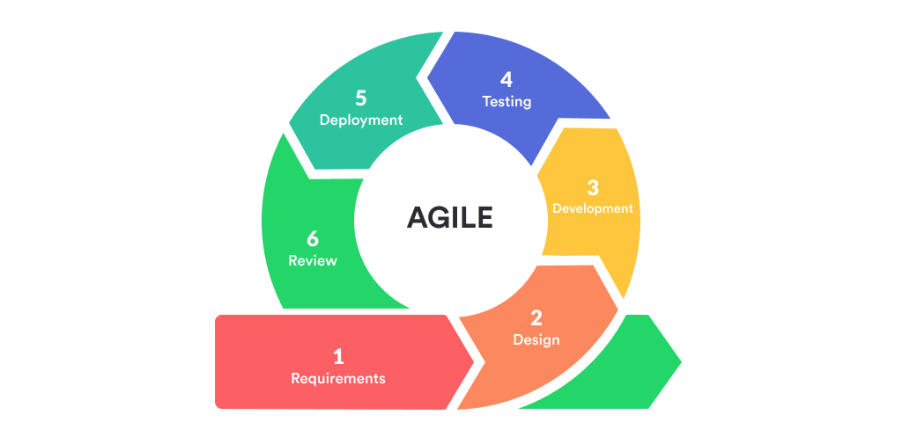

# Software Development Life Cycle, Agile, and SCRUM
 
## SDLC
  ### What is SDLC?
  - SDLC is a process used by the software industry to design, develop, and test high quality software
    - SDLC is governed by an international standard (ISO/IEC 12207)
  - SDLC consists of a detailed plan describing how to develop, maintain, replace, and alter or enhance specific software
  ### Phases

  
  
  - Planning
    - Propose alternative solutions
    - Cost estimates
  - Analysis
    - Gather required features
    - Analyze existing systems
    - Scrutinize proposed system for flaws
  - Design
    - Generate documentation
    - UML diagrams, Gantt charts, etc
    - Pseudocode
  - Implementation
    - Actually program the damn thing
  - Testing
    - Write test cases for your code
    - Allows for easier maintenance
    - Let QA attempt to break the product
  - Deployment
    - Application is made available to the user
    - Bugs here can launch a new SDLC
 
### Models of SDLC
  - SDLC is a process to which there are several methodologies to implement that process: Waterfall, Iterative, Agile, DevOps, V-Model, Spiral, Lean, etc.
  - The big picture here is to understand the changes that software development has undergone e.g. why the Waterfall method's failure led to Agile's popularity
  - Waterfall

    

    - Divide software development into separate phases
    - One phase must be finished before beginning the next phase
    - Main focus is gathering all requirements at first and then building the product based off of those requirements
    - Product is delivered once it has been completed
    - Does not allow for much revision due to gathering requirements first and designing around that
    - Think P0 - PizzaBox
	    - Strict requirements shown at the very beginning
	    - Strict timeline of development and due date (code freeze and presentations)
  - Iterative

    

    - Start with a simple implementation of just a subset of the requirements and iterate over the remaining features
    - Main focus is clearly defining major features and minor features that may be modified during the development process
  - Agile

    

    - Every project needs to be handled differently and you need to tailor existing methods to best suit the project requirements
    - Major focus is taking an iterative approach and presenting a working software build at the end of every iteration
    - Leads to a much less detailed plan but this allows for far greater flexibility in terms of features
  
  - DevOps

    

    - Traditionally, the IT operations team is responsible for deploying and managing the software while having little interaction with the development team that writes the code
    - DevOps ensures both teams work closely together
    - Sometimes both teams are even merged into one, where an engineer will work on the entire SDLC
  
  - V-Model (Verification and Validation Model)

    
  
    - Can be considered an extension of Waterfall
    - Each development is closely followed by testing right after, so this method goes back and forth between development and testing often
    - A phase must be fully completed before moving onto the next
    - Verification is a static analysis technique which is reviewing without executing the code
    - Validation is a dynamic analysis technique which is actually executing the code and running it through tests
  - Spiral Model

    

    - Has 4 phases that a software project repeatedly passes through--called Spirals--until it is completed
    - Identification, Design, Construction, Risk Analysis
  - Lean Model

    

    - Reduce unnecessary work at every opportunity (cutting meetings, reducing documentation, etc.) 
    - Only work on what is essential at the time so no multitasking
    - Agile incorporates a lot of Lean methodology
	  - Both care about fast delivery of working software
	    - Agile does this through small batch sizes and “sprints”
            - Lean does this through cutting as much unnecessary cost, scope, and work in general as possible
 
  ### Pros and Cons of SDLC
  - Pros
    - Systematic way of developing software
    - Repeated use allows for quicker development periods due to programmers gaining experience in the processes
    - Promotes transparency since it requires large amounts of communication
  - Cons 
    - Poor planning can result in similar levels of product performance
    - Large amounts of documentation can lead to confusion/potentially conflicting documents depending on who wrote them
    - Requires good team communication
 
## Agile
  ### The 12 Principles of the Agile Manifesto (summary/interpretation):
  - https://agilemanifesto.org/principles.html
  1. First priority is to satisfy the client
  2. Flexible to changes in requirements at any point
  3. Frequently deliver working software
  4. Developers and business people frequently work together
  5. The people working on the project should care about the project
  6. Best method of communication is face-to-face
  7. Progress is measured by working software
  8. Effort should be constant throughout the SDLC so as to avoid burnout but still be efficient
  9. Frequently pay attention to good design
  10. ”..Simplicity--the art of maximizing the amount of [unnecessary] work not done..” Basically, don’t do unnecessary work
  11. Promotes self-organizing teams such that teams don’t depend on a manager but manage their own associated responsibilities and timelines
  12. Regularly reflect on what’s working well and not working well for the team, and implement the necessary changes
 
  ### Advantages of Agile
  - Client plays a larger role
	  - Increased client satisfaction since the final product is more likely to truly meet their requirements
  - Shorter Time To Market (TTM)
	  - Since working software is frequently delivered, it’s possible for a client to get the application out sooner
  - Flexibility
	  - The product can easily adapt to any additional requirements by the client
  - Teamwork
    - Autonomous, self-organizing teams plus constant self-reflection results in continuous improvement and better team morale
    - Teamwork and relationship with the client is also improved as well because the frequent communication
 
  ### Disadvantages of Agile
  - Less predictability
    - The more rigid waterfall process makes it easier to quantify the time, effort, and cost of the final product as opposed to Agile
  - Takes longer
	  - Having such frequent communication between the testers, developers, and client is a time-consuming process
  - Client plays a larger role
	  - This is listed as both an advantage and a disadvantage because a lack of communication can severely hamper the development of the product
	  - Clients must be willing and able to play a much larger role in the SDLC than as opposed to another approach
  - Poor documentation
	  - Requirements are spelled out flexibly and just in time for development as opposed to all at the beginning which can lead to less detailed documentation
    - This can cause a newer developer to the team to be unsure of how certain features perform since they were not present at the frequent meetings with the client
  - Scope creep
	  - Agile is more prone to scope creep as constant changes and uncontrolled growth in the project’s scope can lead to a project never being completed 
  - Overall be careful to use Agile when clients have a strict budget, deadline, and project scope
 
## SCRUM
  ### What is SCRUM
  - An Agile framework that helps teams apply adaptive solutions to complex problems
  - Framework focuses on direct contact with the product owner and breaking their desired product into sections known as Sprints
  - Developers outline goals for each Sprint and work on them
  - At the end of each Sprint the developers meet with the product owners, review the work that was completed, and adjust plans for the next Sprint as needed
  ### Scrum Roles
  - Product Owner
    - NOTE: Product Owner is 1 person, not all stakeholders
    - Responsible for maximizing the value of the product resulting from the work of the Scrum Team
    - Develops the Product Goal
    - Creates and triages the Product Backlog items
  - Scrum Master
    - Accountable for ensuring team is following Scrum framework
    - Essentially a coordinator, makes sure the developers are working and fixes any roadblocks they may run into
    - Typically is the middleman between the Product Owner and the Developers
  - Developers
    - Create a plan for the Sprint, the Sprint Backlog
    - Adapt their plan as needed to reach the Sprint Goals
    - Hold each other accountable
  ### Scrum Cycle
  - Sprint

    

    - Fixed length period of one month or less
    - Time period where you work towards achieving the goals listed in the Sprint Planning, Daily Scrums, previous Sprint Review, and previous Sprint Retrospective
    - Product Backlog and scope of project can be clarified with the Product Owner as issues arise
  - Sprint Planning
    - Lays out the work that should be accomplished during the upcoming Sprint
    - Communication between Scrum Team and Product Owner is crucial. Questions typically asked are:
      - Why is this Sprint valuable?
        - Helps the team decide on a Sprint Goal
      - What can be accomplished this Sprint?
        -  Helps narrow down items on the Product Backlog
      - How will the chosen work get done?
        - Developers break Product Backlog items down into individual days and assign roles
  - Daily Scrum
    - ~15 minute Daily meetings where you adjust the Sprint Backlog based on your progress towards the Sprint Goal
    - If the Product owner or Scrum Master are working on items in the Sprint Backlog, they act as developers 
    - Often times team members meet immediately after the Daily Scrum for more technical discussions about issues they are facing
  - Sprint Review
    - Inspect the outcome of the Sprint and determine any future adaptations
    - The Product Backlog may be adjusted based on the progress in the current Sprint
    - Typically includes the following:
      - Product Owner explains what Product Backlog items have been Done and what are not Done
      - Developers discuss what went well during the Sprint, what problems they ran into, and the solutions they found
      - The Product Owner projects delivery dates based on the current progress and assess budget concerns if delays occurred
      - Team decides how to move forward to help ease the upcoming Sprint’s Sprint Planning
  - Sprint Retrospective
    - Inspect how the last Sprint went and what got Done
    - Identify the most helpful changes to improve effectiveness
    - Discuss what went well during the Sprint
    - Discuss what could have been improved during the Sprint
    - Discuss how developers will improve in the next Sprint
  - Scrum Documentation
    - Sprint Backlog
      - Composed of the Sprint Goal (the Why), the set of Product Backlog items selected for the Sprint (the What), and an action plan for delivering the Increment (the How)
    - Sprint Goal
      - The main objective for a Sprint 
    - Increment
      - A concrete stepping stone toward the Product Goal
      - Work cannot be considered part of an Increment unless it meets the Definition of Done
      - Description of the state of an Increment when it meets the quality measures set in place
    - Product Backlog
      - Ordered list of what is needed to improve the product
      - Gets refined by breaking down items into smaller, more manageable pieces
