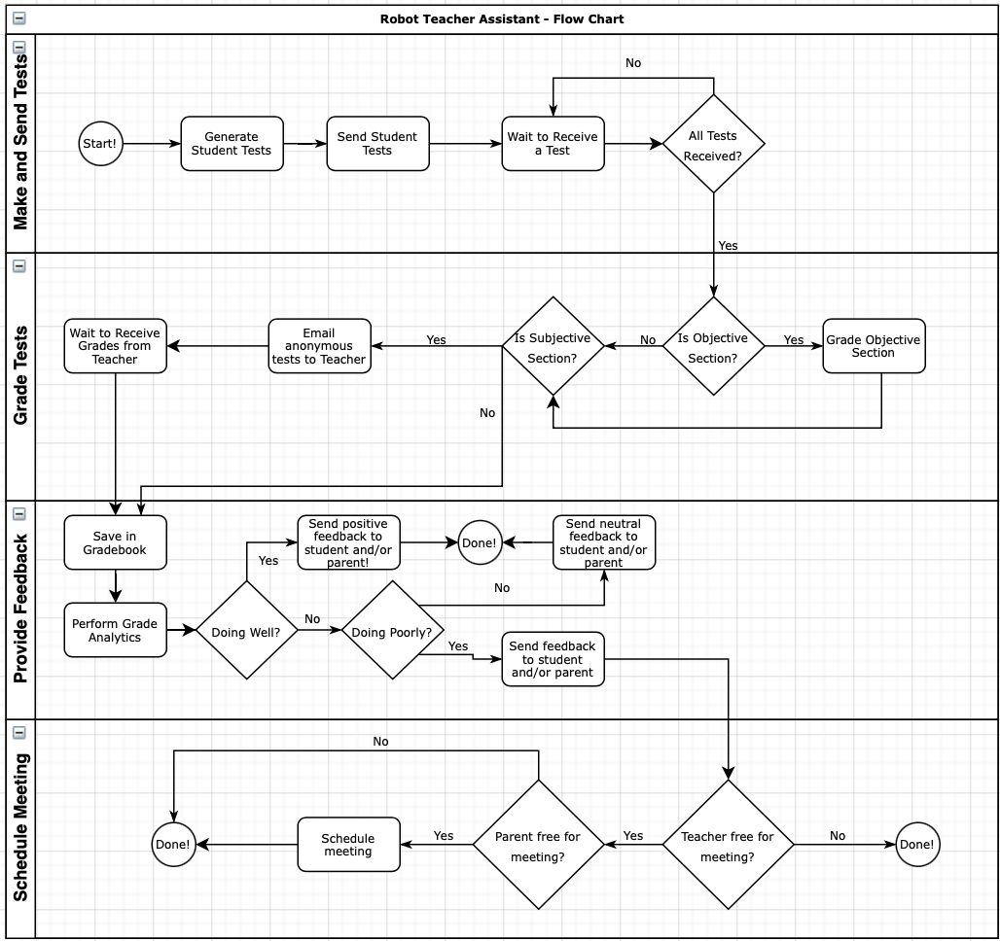

# Robot Teaching Assistant - RTA
**Team: Miles Plurad, Anton Marku, Daniel Lieser**
  
## Overview
Being a teacher can be difficult. They not only have to teach but make tests, grade tests, setup meetings with parents, create lessons plans, and so much more. Their responsibility in teaching the youth makes it no exaggeration to say they have a vital role in shaping society. In order to help take the pressure off our educators, we thought it would be a great idea to automate some of their most mundane and repetitive tasks, so that they can focus on what really matters--educating the next generation.
 
## What is Robot Teaching Assistant (RTA) all about?
Our project is centered around automating the entire life cycle of student tests. This includes the making of the test, distribution, grading, grade analytics, sending feedback, and even scheduling meetings with parents if need be. This frees up time for teachers to do what they do best, and that's teach.
 
*Our Goals for RTA*
 
- Generate a test and answer key in Google Forms from a text document
    - There will be a general guidline on how the text document must be formatted
- Distribute those tests to students and receive them back upon completion
- Grade those tests and perform grade analytics based on previous performance
    - Grades are also automatically saved to an external gradebook
- Provide feedback to the students and/or parents based on test results and grade analytics
    - Automatically setup a parent-teacher meeting at this point if necessary
 
*Our Qualifications*
 
- The three of us are currently expanding our knowledge in UI Path and specifically RPA for the next few weeks, so that we can build this robot and provide teachers with the best robot teaching assistant yet!
 
## Why is it Important? 
We believe that RTA is something that the education system needs and is ready for. Many teachers already use automation technologies like a Scantron, so this is taking that one step further. Even though there's software that automatically grades tests, we recognized that even more of the student-test life cycle could be automated to lessen the workload of being a teacher. Our robot will be a combination of technologies from both the past and present to help our educators and thus shape society for the better!

## Flow Chart

