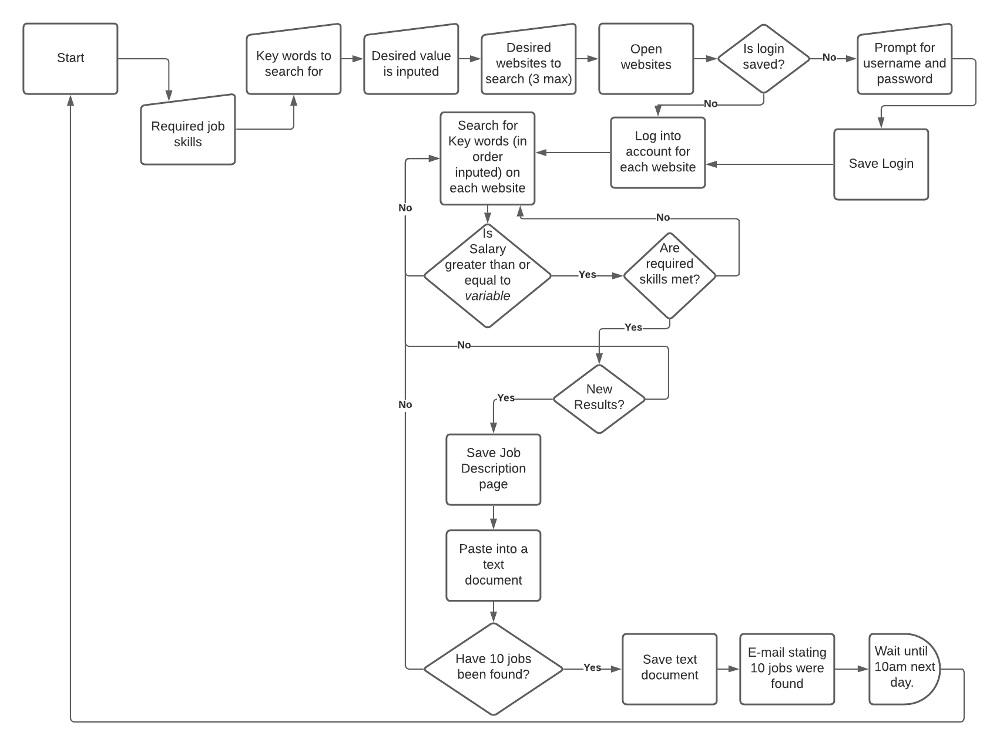


# Job Aggregator
**Authors:**
**Names: Eduardo Reyes, Kirby Chan, Joe Stalnaker**
  
## Overview
If you have ever been in the market for a job, chances are that you have spent a lot of time on job boards like Indeed or Glassdoor. You might also know how time consuming it can be. From hopping between the different websites, to looking at reviews, to reading through each job description for all the important information. Doing this for one or two jobs might be okay, but if that number increases to 100, then it can be fairly tiring. If we can condense down that information, it will make searching for a job a way better experience. This is where our automation becomes of use. Instead of doing all that work yourself, we let the robot do all the heavy lifting.
 
## What is our Automation Project About
Our automation project is centered around creating an attended robot that will assist a user with aggregating job postings found across online different job boards. Taking only one input from the user, the robot will then proceed to go to work and quickly compile a list of jobs in an Excel document. This list will contain a summary of all the information you might want to know about each job posting as well as a link to the actual posting if you decide to apply.
 
*Our Goals for the Robot*
 
- The goal of our robot is to leverage UIPATH Studio in helping a user search for jobs by aggregating it in one location.
- We plan to scrape the web of job postings on all the major job boards.
- The information about each job posting and its related information (e.g. time posted, salary, etc.) will be obtained through Google Chrome and inserted into an Excel spreadsheet.
 
*What are Our Qualifications to Build this Robot?*
 
- I'm glad you asked! For the past few weeks, our group has been studying night and day the ins and outs of UIPATH Studio. Whether it be learning how to speak to the web or manipulating data, we are becoming increasingly proficient using the studio. 
- In addition, the three of us plan to continue expanding our knowledge in this domain for the next few weeks, so that we can continue to build our robot and provide the end user with the most efficient way to perform a boring repetative task!
- This will give the end user some time back to work on other tasks while our automated robot does all the tidious and repetative process. 
 
## Why is it Important? 
The essence of automation is taking the various mundane and tedious tasks in our lives and making them less time consuming. This can be anything from be automatic paychecks or a gas pump handling a transaction from beginning to end. These types of technologies have redefined the way in which we live by allowing us to spend our time on more important things. We believe that our robot is the next step. Job searching fits under that same umbrella of being very laborious and if there is some way to change that, then we should. A job aggregation robot is something many people can make of good use. 

## Flow Chart

