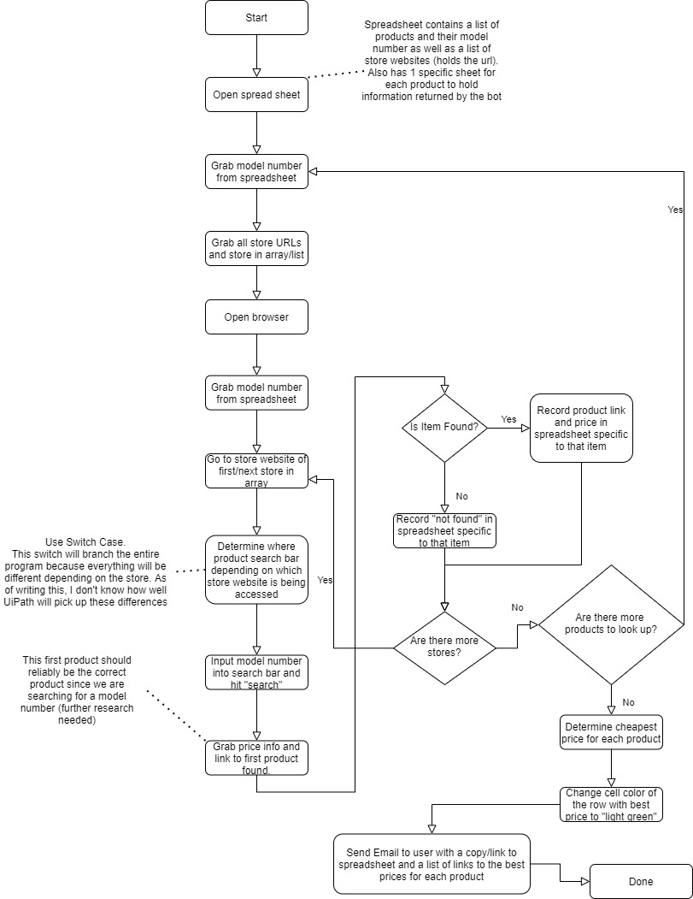

# Automatic Electronic Price Comparator

Authors: Jeffery Breiner, Nick Nevius, Sean Lee, Sean Spring

##  Overview
Comparing phone and electronics prices can be tedious and difficult to find the best price. Thankfully, we can automate searching for different phones over different websites to find the best deals.

## About
We can use automation to search for a product, find the UPC or model number, and compare prices of products from various stores. We can also use this process to find similar products or models that the user might be interested in, based on the initial search. These results will then be written to a separate sheet to catalog these results so the customer can select the product they want. Emails the user, asks if they want to add the product to cart. The URL of the product with the best price is listed in the email, as well as the Excel document.

### Goals
- Have a pre-made excel sheet that holds a list of electronic products like phones with their model number or generate a sheet of related products based on one user inputed product.
- UiPath can search through various store websites and scrape information on price and specs and generate an excel sheet that holds that information.
- UiPath can create and send an email with the best products described and ask if they want to add to cart. The excel sheet will also be attached. 

### Qualifications: 
- We’re currently undergoing UiPath’s own certified training course, and will be RPA experts in the coming weeks.
- We have been managing Git repositories on Github for 5.5 weeks as of now,

## Why
Searching for the right electronic, be it a new phone or computer, can be a daunting task. These are expensive products and the price is an important factor of the purchase. We are saving users time by searching popular electronic websites and stores to find the best price, potentially similar or related products/models, and allow the user to make a decision based on the result of this process. Additionally, the user can decide whether or not he or she would like to add that product to their virtual shopping cart, and potentially allow the user to begin the checkout process. 

## Flow Chart

